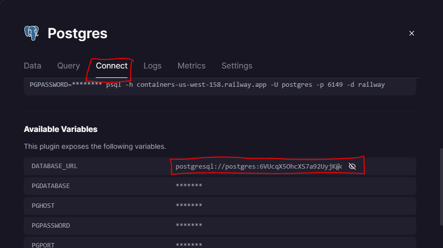

# Project 1
Web Programming with Python and JavaScript

## SEARCHBOOKS

##### SEARCHBOOKS es una applicación web en donde un usuario una vez que cree una cuenta y se registre podrá comenzar a buscar los libros de su interés y acceder a la información determinada que se obetiene de una base de datos y una API  (Google Books API), además tendrá la posibilidad de publicar una reseña para cada libro al que desee.

### DESPLIEGE DE LA APPLICACIÓN WEB.
##### Este proyecto está desarollado mayormente en flask, por lo que para ejecutar este es necesario seguir los siguientes pasos:

#### 1. Creación de un entorno virtual.
##### Escribe en la terminal los siguientes comandos:
1. `python -m venv env`
2. `.\env\Scripts\activate`
##### En el caso que arroje un error escriba en la terminal lo siguiente:
3. `Set-ExecutionPolicy -ExecutionPolicy RemoteSigned -Scope Process`
##### y vuelve a ejecutar el comando numero dos.

### 2. INSTALACIÓN DE LOS REQUERIMIENTOS.
##### Una vez dentro del entorno virtual, debemos descargar aquellas requerimiento para que el programa funcione. Para hacer eso ejecuta el siguiente comando:
4. `pip install requirements.txt`

##### espere unos segundos.
### 3. Crear base de datos.
##### Este proyecto utiliza la web [https://railway.app/new](https://railway.app/new) para crear las tablas donde almacenaremos la información necesaria.
##### Antes de crear las tablas crea un nuevo proyecto pasra POSTGRESQL  y en la parte donde dice "Query" ejecuta en orden lo siguiente:
```sql
CREATE TABLE users (
  id SERIAL PRIMARY KEY,
  name Text,
  email Text,
  password Text
);

```
##### luego:
```sql
CREATE TABLE books (
  id SERIAL PRIMARY KEY,
  isbn Text,
  title Text,
  author Text,
  year Text
);
```
##### y por ultimo: 
```sql
CREATE TABLE reseñas (
  id SERIAL PRIMARY KEY,
  id_books INTEGER REFERENCES books(id),
  id_user INTEGER REFERENCES users(id),
  reseña TEXT,
  rating INTEGER,
  fecha_reseña DATE
);

```
##### Una vez creadas las tablas que estaremos utilizando, debemos establecer en nuestro codigo la conexión a la base de datos. Para ello crea un archivo llamado ".env" en la carpeta donde está alojado el proyecto y pon lo siguiente:
```python
DATABASE_URL=  link_de_conexion
```
##### Donde link_de_conexión será remplazado por el link que extraeremos de Railway en la siguiente parte:


### 4. Importando libros.
##### Una vez que ya tengamos la conexión lista, el siguiente paso es importar los libros que tenemos en books.csv a la tabla books en railwat, para esto ejecutamos el programa import.py. Escribiendo en la terminal:
1. `python import.py`

### 5. Ejecutando la aplicación web en nuestro dominio.
##### a vez que hayamos hecho los pasos anteriores solo falta ejecutar nuestro programa en flas para que vizualicemos y acedamos a todas las funciones que hemos programado, para esto ejecuta lo siguiente en la terminal: 
1. `flask run`.

### 6. 	Consulta a la api.
##### Para poder acceder a la api que he realizado puede hacerlo por el enlace que dejo en la información delo libro o bien, copiando en lo siguiente:
`http://127.0.0.1:5000/api/isbn`
##### Donde isbn es el isbn correspondiente al libro el cual se quiere acceder a su json.
